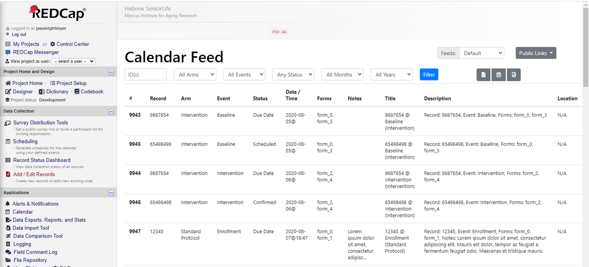
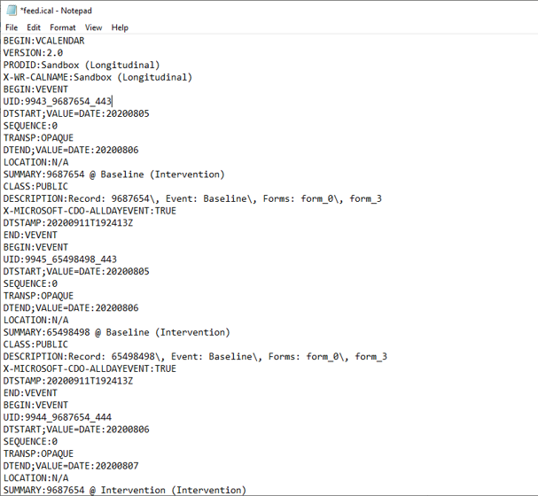
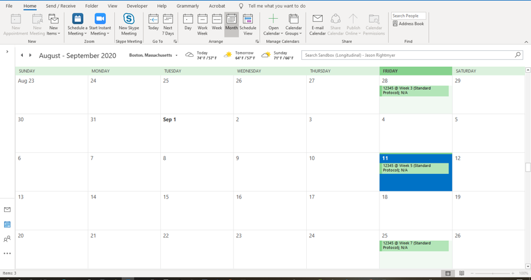

# Marcus Institute - Calendar Feed - REDCap External Module
## Purpose
The purpose of the REDCap module is to provide projects with the abilty to query and export calendar schedules for use by third-party tools.  Export formats include CSV, JSON and iCal.  The iCal feed may be used to import calendar schedules into applications such as Google Calendar, Microsoft Outlook and mobile devices.
### Developer Information
Please contact the Director of Research Informatics (ifar-informatics@hsl.harvard.edu) at the Marcus Institute for more information.  
## Concepts
Please see the online tutorials and support material for the proper set up and use of the built-in REDCap Scheduling feature.  
* https://redcap.vanderbilt.edu/consortium/videoplayer.php?video=scheduling02.flv&title=Scheduling+Module+%287+min%29&text=&referer=REDCAP_PUBLIC

This module uses the calendar events generated and stored within the REDCap database.  The module  pulls these data and generates a custom data set that is transformed into requested formats (iCal, CSV, etc.).  In addition to the existing system fields (record, events, forms, event status, event date/time) the module "calculates" additional fields for use within the exports.  
1. Title - Title attribute of Outlook/Google Calendar event
2. Description - Body attribute of Outlook/Google Calendar event
3. Location - Location attribute of Outlook/Google Calendar event

There are two major concepts in this module, and they must be defined at the project level to generate exports and make the data available publically.  Further description of each is provided below.
1. Calendar Feed(s)
2. Calendar Link(s)
### Calendar Feed
A calendar feed represents a customized view of all of the scheduled events in the system.  The contents of a feed may be filtered and downloaded into a variety of formats.  Out of the box all projects have a "default" feed, which corresponds to a simple display of scheduling data.  Most projects will create at least one custom feed.

A feed has the following properties.  The custom feed contains three specific templated attributes (title, description and location) that correspond directly to fields found in an iCal (Outlook/Google) file.   

| Property | Type   | Description                      | Example          |
|----------|--------|----------------------------------|------------------|
| key      | string | Primary, unique key for the feed used in URL generation | ``` all_participants ``` |
| name      | string | Display name for the feed | ``` All Study Participants ``` |
| title_template      | string | Twig template that generates a title of iCal/Outlook event | ``` {{record}}@{{event_name}} ``` |
| description_template      | string | Twig template that generates body description of iCal/Outlook event (may be blank) | ``` Forms: {{forms}} ``` |
| location_template      | string | Twig template that generates location field of iCal/Outlook event (may be blank) | ``` {{clinicname}} ``` |
| data_fields      | string | Comma-separated list of REDCap fields to be included in the twig template (may be blank) | ``` firstname,lastname,clinicname,dob ``` |
### Calendar Feed Link
Calendar Feeds are not automatically accessible outside of REDCap sessions. The project administrator must explicitly define a *Calendar Link* to make the data (iCal, JSON, CSV) available outside of REDCap.  All link requests are performed with NOAUTH security context.

> NOTE: It is possible that a project may define one or multiple feeds, but never use links to expose the data.  For example, feed data may be downloaded and imported manually into a Google Calendar.

A link is defined by the following properties.

| Property | Type   | Description                      | Example          |
|----------|--------|----------------------------------|------------------|
| key      | string | Primary, unique key for the feed used in URL generation (GUID or random sequence recommened) | ``` 00394e6e-ca12-478f-a4a4-4fd00b771379 ``` |
| name      | string | Display name for the feed | ``` Treatment A Schedule ``` |
| params      | string | URL querystring containing feed key (at minimum) and additional filters (optional)  | ``` feed=all_participants&arms[]=treatment_a ``` |
| enabled      | boolean | Allows project admin to disable a link if needed | |
| access_level      | enum [Public, Restricted] | Sets the security level for the link | |


## Project Caveats
REDCap administrators should consider the following when enabling the module.

* This module works only for longitudinal projects.  Singleton REDCap projects are not supported.
* Public link feeds have *no security contect*.  Althought the details of the query are hidden from the feed results; the query and subsequent return data set are executed without authentication or authorization. Public links should be used causiously and scrutinized appropriately. 
  * PHI should not be included in feeds used with public links.  If PHI is included then the link should be proxied with an appropriate basic authentication schema.  
  * Public link feeds inherit the TLS/SSL settings of the parent REDCap installation and Web server settings
   
## Requirements
Please review the PHP composer file for specific dependancies.  It is important to note that the module employs the Twig v3 (https://twig.symfony.com/doc/3.x/) template engine.  Administrators should feed comfortable using Twig to customize title, description and location templates.   

## Configuration Details
Please see concepts above for general details
### Query String Parameters
The feed and link params accept the following HTTP querystring arguments.  These arguments are used to filter the data for display or transformation.  

| Property | Type   | Description                      | Example          |
|----------|--------|----------------------------------|------------------|
| feed      | string | Feed key as specified in the config | ``` feed=all_participants ``` |
| arms      | array(int) | PHP array of arm numbers (as defined in REDCap) | ``` arms[]=1&arms[]=2 ``` |
| events      | array(int) | PHP array of unqiue Event names (as defined in REDCap) | ``` events[]=baseline_arm_2&events[]= ``` |
| status      | number | Number corresponding to scheduling event status (see list below) | ``` status=2 ``` |
| month      | numeric | Month (0=Jan...11=Dec)  | ``` month=0 ``` |
| year      | numeric | Four-digit calendar year  | ``` year=2019 ``` |

#### Statuses
REDCap defines the status for each calendar/schedule event as follows.
| Value | Label   |
|----------|--------|
| *blank*      | Not specified |
| 0      | Due Date |
| 1      | Scheduled |
| 2      | Confirmed |
| 3      | Cancelled |
| 4      | No Show |

#### Examples
TBD

### Twig Details
See Twig Web site for syntax documentation.  When generating a calendar feed item (single iCal event), the system creates a PHP object, which is supplied as context to the Twig system.  A sample context obect is provided below.  Using this sample, we can generate content using example templates.
```php
[
  "cal_id" => 234,
  "record" => "123-43"
  "event_id" => 156
  "project_id" => 45
  "event_date" => "01/05/2020"
  "event_time" => "12:00"
  "event_status" => 2
  "event_status_name" => "Confirmed"
  "notes" => "Patient rescheduled for unknown reason"
  "event_descrip" => "Baseline"
  "arm_name" => "Intervention"    
  "forms" => [
    "form1",
    "form99"
  ],
  "data" => [
    "dob" => "01/01/1960",
    "city" => "Boston",
    "clinicname" => "Hebrew SeniorLife"
  ]
]
```
#### Examples
TBD

## Screenshots
### REDCap (Default View)

### iCAL Export

### Outlook (Internet Calendar) Import
